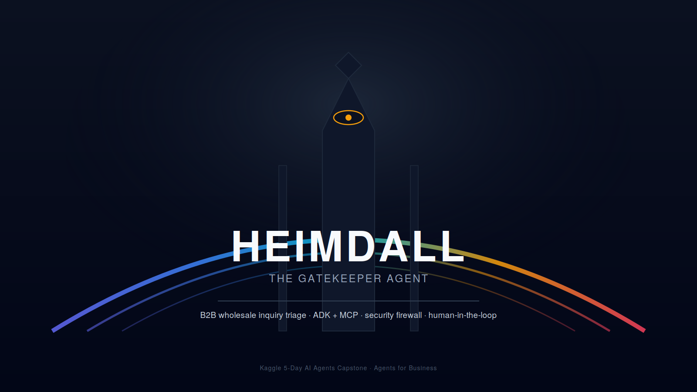
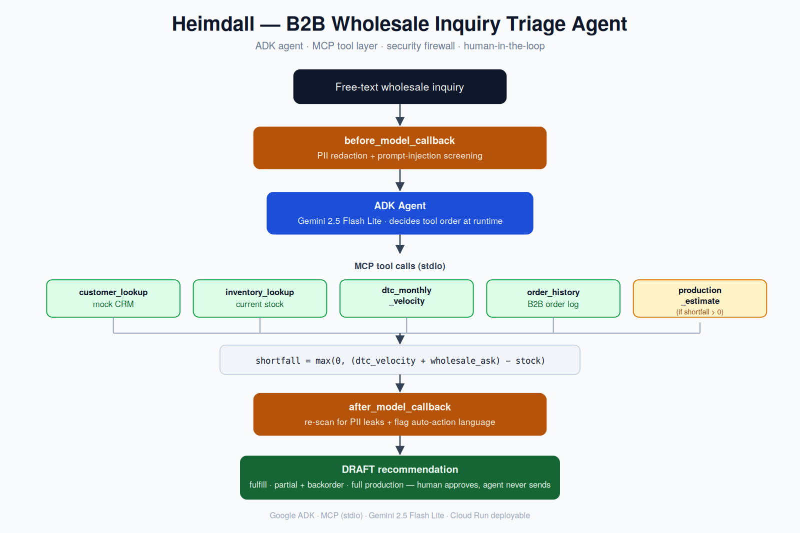

# Heimdall



> Named for the Norse gatekeeper, the one who watches the Bifrost and decides what's allowed through. Marvel fans will know him as the guy Idris Elba played in *Thor*. Same job here: everything that comes in gets watched, screened, and only passes if it's supposed to.

Heimdall is an ADK agent that triages inbound B2B wholesale inquiries. It screens, scores, and drafts a response, but never auto-sends. A human reviews and approves every output.

Built for the Kaggle 5-Day AI Agents capstone.

## Why it exists

B2B wholesale inquiries ("I want 500 units, what's your pricing?") arrive as free text and require judgment: Is this company real? Can we actually fulfill the order from current stock, or does it require new production? What's the cost and timeline? This is exactly the kind of multi-step reasoning that benefits from an agent, it's not a script, because each step depends on the previous one and on live data lookups.

Key design decision: the agent never acts autonomously. Every output is a draft for human review. The MCP tool layer enforces this at the guardrail level, not just in the instructions.

## Architecture



```
inquiry text
     |
     v
before_model_callback       <- PII redaction + injection detection
     |
     v
ADK Agent (Gemini 2.5 Flash Lite)
     |
  [tool calls via MCP stdio]
     |
     +-- customer_lookup         <- mock CRM
     +-- inventory_lookup        <- current stock
     +-- dtc_monthly_velocity    <- DTC burn rate per product
     +-- order_history           <- B2B order history
     +-- production_estimate     <- lead time + cost for shortfall
     |
     v
after_model_callback        <- output PII/policy gate
     |
     v
DRAFT response (human reviews before any action)
```

> Model note: running on `gemini-2.5-flash-lite` for better AI Studio free-tier rate limits. `gemini-2.5-flash` works identically if you have quota headroom, swap the model string in `app/agent.py`.

## How this was built

Design and code were kept in separate stages on purpose. Architecture decisions (which MCP tools exist, what the security firewall enforces, what a shortfall calculation looks like) were locked down before any code was written, then handed off as a single spec document for implementation to build against. That spec is append-only: every architectural change during the build got added to it rather than overwriting the original decisions, so the full reasoning behind the current design is still visible, not just the end state.

The one deviation from the original spec, splitting `dtc_monthly_velocity` into its own tool instead of folding it into `order_history`, happened because the two are genuinely different data sources in a real e-commerce business (storefront vs. B2B ledger), and collapsing them would have hidden that distinction from the agent's reasoning trace.

## Quickstart

### Requirements
- Python 3.12+
- `conda` (miniconda or anaconda)
- A Google AI Studio API key (local dev) or a GCP project with Vertex AI enabled (prod)

### Local dev

```bash
# Activate the env (or create it: conda create -n heimdall python=3.12)
conda activate heimdall
pip install -r requirements.txt

# Set up env vars
cp .env.example .env
# Edit .env and add your GOOGLE_API_KEY (see below)

# Run CLI
./scripts/start.sh

# Or run in ADK web UI (better for demos)
./scripts/start.sh web
```

### Environment variables

`.env.example` in the repo root:

```dotenv
# Local dev: AI Studio key (no GCP billing)
GOOGLE_API_KEY=

# Production: set these instead of GOOGLE_API_KEY
GOOGLE_CLOUD_PROJECT=
GOOGLE_CLOUD_REGION=
GOOGLE_GENAI_USE_VERTEXAI=true

# Dev toggle: forces all MCP tool calls to return fixture data
# MOCK_MODE=true
```

For local development, copy this to `.env` and set `GOOGLE_API_KEY` to a Google AI Studio key. For production (Cloud Run / Vertex AI), leave `GOOGLE_API_KEY` unset and instead set `GOOGLE_CLOUD_PROJECT`, `GOOGLE_CLOUD_REGION`, and `GOOGLE_GENAI_USE_VERTEXAI=true`. Uncomment `MOCK_MODE=true` to run the agent against fixture data only, useful for testing the reasoning chain without burning API quota.

`.env` itself is gitignored and never committed, only `.env.example` (with blank values) ships in the repo.

### Run tests

```bash
conda activate heimdall
python -m pytest tests/ -v
```

## Reasoning chain

For each inquiry, the agent:

1. Extracts product ID, requested quantity, and company ID from the text
2. Looks up the company via `customer_lookup`
3. Checks current stock via `inventory_lookup`
4. Gets DTC monthly burn via `dtc_monthly_velocity`
5. Computes shortfall: `max(0, (dtc_velocity + wholesale_ask) - stock)`
6. If shortfall > 0, calls `production_estimate` for lead time and cost
7. Synthesizes a recommendation and drafts a response email

## Triage outcomes

| Scenario | Condition |
|---|---|
| Immediate fulfillment | shortfall == 0 |
| Partial fulfillment + backorder | 0 < shortfall < wholesale_ask |
| Full production order | shortfall >= wholesale_ask |

## Security

- **Input firewall**: `before_model_callback` redacts PII (email, phone, address, names) and screens for prompt injection before any LLM call. Detected injection short-circuits the entire pipeline.
- **Output gate**: `after_model_callback` re-scans the draft for leaked PII and flags any language suggesting an auto-sent action.
- **Tool guardrails**: all tools are read-only. The agent has no direct DB access.
- **No secrets in code**: all keys via `.env`, never committed.

## Mock data

All tool lookups use fixture files in `mcp_server/data/`:
- `mock_customers.json`: COMP-001 (Apex/Gold), COMP-002 (Beacon/Silver), COMP-003 (Summit/Standard)
- `mock_inventory.json`: PROD-A (Eco Yoga Mat, 600 stock, 400/mo DTC), PROD-B (Organic Towel, 150 stock, 100/mo DTC)
- `production_config.json`: 50 units/day, 2-day setup, tiered cost ($12/$10/$8)

To test the shortfall path: ask about COMP-001 ordering 300+ units of PROD-A (600 stock, 400 DTC burn, so 100+ units will require production).

## Deployment

```bash
export GOOGLE_CLOUD_PROJECT=your-project-id
export GOOGLE_CLOUD_REGION=us-central1
./scripts/deploy.sh
```

This wraps `adk deploy cloud_run --allow-unauthenticated`. Not Agent Runtime, Cloud Run is used specifically for unauthenticated public access during the demo.