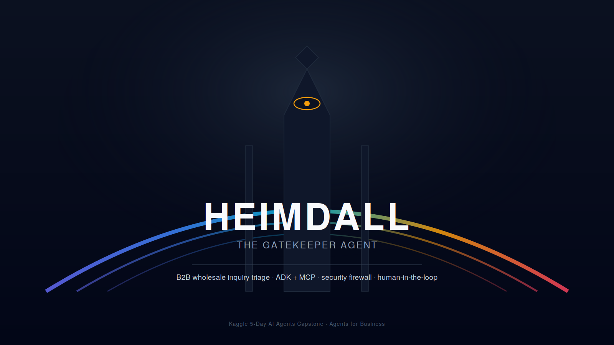
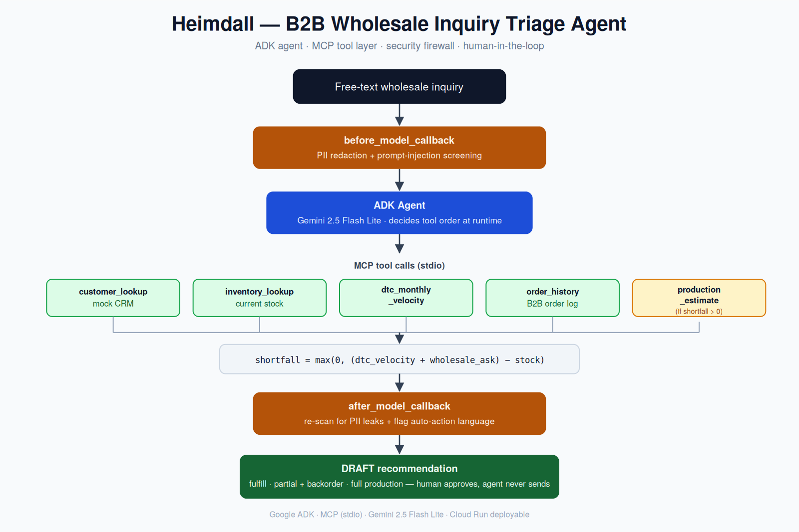

# Heimdall
<!-- version: v2.3.0 -->




> Named for the Norse gatekeeper, the one who watches the Bifrost and decides what's allowed through. Marvel fans will know him as the guy Idris Elba played in *Thor*. Same job here: everything that comes in gets watched, screened, and only passes if it's supposed to.

Heimdall is an ADK agent that triages inbound B2B wholesale inquiries. It screens, scores, and drafts a response, but never auto-sends. A human reviews and approves every output.

Built for the Kaggle 5-Day AI Agents capstone.

## Why it exists

B2B wholesale inquiries ("I want 500 units, what's your pricing?") arrive as free text and require judgment: Is this company real? Can we actually fulfill the order from current stock, or does it require new production? What's the cost and timeline? This is exactly the kind of multi-step reasoning that benefits from an agent, it's not a script, because each step depends on the previous one and on live data lookups.

Key design decision: the agent never acts autonomously. Every output is a draft for human review. The MCP tool layer enforces this at the guardrail level, not just in the instructions.

## Architecture



```
inquiry text
     |
     v
before_model_callback       <- PII redaction + injection detection
     |
     v
ADK Agent (Gemini 3.1 Flash Lite)
     |
  [tool calls via MCP stdio]
     |
     +-- customer_lookup         <- mock CRM
     +-- inventory_lookup        <- current stock
     +-- dtc_monthly_velocity    <- DTC burn rate per product
     +-- production_estimate     <- lead time + cost for shortfall
     |
     v
after_model_callback        <- output PII/policy gate
     |
     v
DRAFT response (human reviews before any action)
```

The MCP server also registers an `order_history` tool (B2B order history lookup), but the agent's current reasoning chain doesn't call it, so it's left out of the flow above. It's available for the agent to use if the instructions are extended to need it.

> Model note: defaults to `gemini-3.1-flash-lite`, read from the `GEMINI_MODEL` env var (see below). Swapping models means updating one env var, not redeploying code.

## How this was built

Design and code were kept in separate stages on purpose. Architecture decisions (which MCP tools exist, what the security firewall enforces, what a shortfall calculation looks like) were locked down before any code was written, then handed off as a single spec document for implementation to build against. That spec is append-only: every architectural change during the build got added to it rather than overwriting the original decisions, so the full reasoning behind the current design is still visible, not just the end state.

The one deviation from the original spec, exposing `dtc_monthly_velocity` as its own MCP tool instead of folding it into `order_history`, happened because the two are genuinely different data sources in a real e-commerce business (storefront vs. B2B ledger), and collapsing them would have hidden that distinction from the agent's reasoning trace. (Implementation-wise, `get_dtc_monthly_velocity` still lives in `mcp_server/tools/order_history.py` alongside the order-history lookup; `server.py` is what exposes it as a separate tool.)

## Quickstart

### Requirements
- Python 3.12+
- `conda` (miniconda or anaconda)
- A Google AI Studio API key (local dev) or a GCP project with Vertex AI enabled (prod)

### Local dev

```bash
# Activate the env (or create it: conda create -n heimdall python=3.12)
conda activate heimdall
pip install -r requirements.txt

# Set up env vars
cp .env.example .env
# Edit .env and add your GOOGLE_API_KEY (see below)

# Run CLI
./scripts/start.sh

# Or run in ADK web UI (better for demos)
./scripts/start.sh web
```

`web` mode runs `uvicorn app.main:app`, an explicit FastAPI app built via ADK's `get_fast_api_app()` rather than the bare `adk web` CLI shortcut — this is the documented extension point for adding custom server-side logic (session hooks, middleware) on top of the same dev UI, not a fork of it.

### Environment variables

`.env.example` in the repo root:

```dotenv
# Local dev: AI Studio key (no GCP billing)
GOOGLE_API_KEY=

# Production: set these instead of GOOGLE_API_KEY
GOOGLE_CLOUD_PROJECT=
GOOGLE_CLOUD_REGION=
GOOGLE_GENAI_USE_VERTEXAI=true

# Model string, overrides the default in app/agent.py without a redeploy
# GEMINI_MODEL=gemini-3.1-flash-lite

# Dev toggle: forces all MCP tool calls to return fixture data
# MOCK_MODE=true
```

For local development, copy this to `.env` and set `GOOGLE_API_KEY` to a Google AI Studio key. For production (Cloud Run / Vertex AI), leave `GOOGLE_API_KEY` unset and instead set `GOOGLE_CLOUD_PROJECT`, `GOOGLE_CLOUD_REGION`, and `GOOGLE_GENAI_USE_VERTEXAI=true`. `GEMINI_MODEL` is optional in both cases, it falls back to `gemini-3.1-flash-lite` if unset.

`MOCK_MODE=true` is a placeholder for a planned toggle (skip the LLM call entirely, return fixture data) and isn't wired into any code path yet. All tool lookups already run against the mock JSON fixtures in `mcp_server/data/` regardless of this flag, since there's no real backend to switch away from in Phase 1.

`.env` itself is gitignored and never committed, only `.env.example` (with blank values) ships in the repo.

### Run tests

```bash
conda activate heimdall

# Unit + callback tests (no external deps, this is what CI runs)
python -m pytest tests/test_tools.py tests/test_callbacks.py -v

# Full e2e suite also includes test_e2e.py, which needs Ollama running
# locally (`ollama serve` + `ollama pull qwen2.5:7b`) since it drives the
# whole agent pipeline through a local model instead of Gemini
python -m pytest tests/ -v
```

## Reasoning chain

For each inquiry, the agent:

1. Extracts product ID, requested quantity, and company ID from the text
2. Looks up the company via `customer_lookup`
3. Checks current stock via `inventory_lookup`
4. Gets DTC monthly burn via `dtc_monthly_velocity`
5. Computes shortfall: `max(0, (dtc_velocity + wholesale_ask) - stock)`
6. If shortfall > 0, calls `production_estimate` for lead time and cost
7. Synthesizes a recommendation and drafts a response email

## Triage outcomes

| Scenario | Condition |
|---|---|
| Immediate fulfillment | shortfall == 0 |
| Partial fulfillment + backorder | 0 < shortfall < wholesale_ask |
| Full production order | shortfall >= wholesale_ask |

## Security

- **Input firewall**: `before_model_callback` redacts PII (email, phone, address, names) and screens for prompt injection before any LLM call. Detected injection short-circuits the entire pipeline.
- **Output gate**: `after_model_callback` re-scans the draft for leaked PII and flags any language suggesting an auto-sent action.
- **Tool guardrails**: all tools are read-only. The agent has no direct DB access.
- **No secrets in code**: all keys via `.env`, never committed.

## Mock data

All tool lookups use fixture files in `mcp_server/data/`:
- `mock_customers.json`: COMP-001 (Apex/Gold), COMP-002 (Beacon/Silver), COMP-003 (Summit/Standard)
- `mock_inventory.json`: PROD-A (Eco Yoga Mat, 600 stock, 400/mo DTC), PROD-B (Organic Towel, 150 stock, 100/mo DTC)
- `production_config.json`: 50 units/day, 2-day setup, tiered cost ($12/$10/$8)

To test the shortfall path: ask about COMP-001 ordering 300+ units of PROD-A (600 stock, 400 DTC burn, so 100+ units will require production).

## Deployment

```bash
export GOOGLE_CLOUD_PROJECT=your-project-id
export GOOGLE_CLOUD_REGION=us-central1
# Optional, overrides the default model for this deploy only:
# export GEMINI_MODEL=gemini-3.1-flash-lite
./scripts/deploy.sh
```

This wraps `adk deploy cloud_run --with_ui --allow-unauthenticated`, passing `GOOGLE_GENAI_USE_VERTEXAI=true` (and `GEMINI_MODEL` if set) through as Cloud Run env vars. Not Agent Runtime, Cloud Run is used specifically for unauthenticated public access during the demo. `--with_ui` bundles the same dev chat UI used locally alongside the agent API in one service, no separate frontend.
## Changelog
- **v2.3.0** (2026-09-26): minor bump
- **v2.2.1** (2026-09-25): patch bump
- **v2.2.0** (2026-09-25): minor bump
- **v2.1.0** (2026-08-18) — minor bump
- **v2.0.0** (2026-08-18) — major bump
